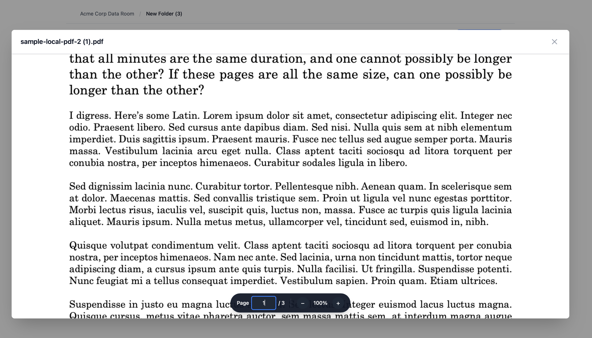
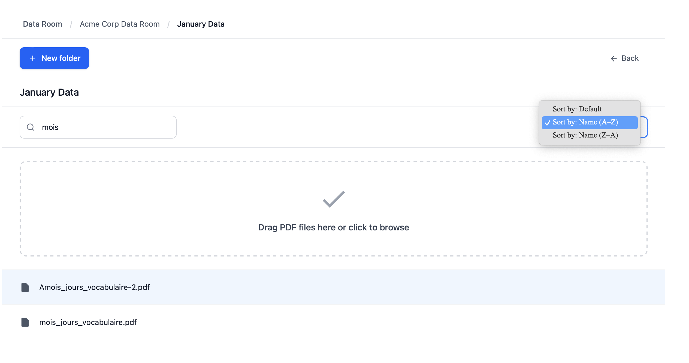

# Data Room

> Production-ready document management application

A fully-featured data room implementation demonstrating enterprise-grade React architecture with TypeScript, responsive design, and comprehensive test coverage.

## Quick Start

### Requirements

- Node.js 18+ and npm 9+

### Installation

```bash
npm install
npm run dev      # Development server at http://localhost:5173
npm run test     # Run test suite
npm run build    # Production build
npm run preview  # Preview production build
```

## Overview

This application provides a hierarchical document management system with real-time search, PDF viewing capabilities, and persistent storage. The codebase demonstrates professional-grade patterns including immutable state management, comprehensive testing, and accessibility compliance.

## Screenshots

**Home View - Folder and File Management**


**PDF Preview - Document Viewer with Navigation**



**Search and Filtering - Real-time Search Results**



## Key Features

### Core Capabilities

- Hierarchical folder structures supporting unlimited nesting
- PDF upload and storage (5MB maximum per file)
- Real-time search with automatic filtering
- Multi-level sorting (ascending, descending, default)
- Automatic conflict resolution for duplicate names

### User Interface

- Inline editing without modal dialogs
- Full keyboard navigation support
- Responsive design optimized for mobile through desktop
- Toast notifications for user feedback
- PDF preview modal with page navigation

### Technical Excellence

- 70+ unit and integration tests
- TypeScript strict mode compilation
- WCAG 2.1 AA accessibility compliance
- Memory-safe async operations with AbortController
- Type-safe component composition with discriminated unions

## Screenshots


## Architecture

The codebase is organized into logical layers following a clean architecture pattern:

- **`src/data/`** - Pure functions implementing all CRUD operations and business logic
- **`src/components/`** - React components providing UI functionality
- **`src/hooks/`** - Custom hooks managing state and side effects
- **`src/utils/`** - Utility functions for naming resolution and filtering
- **`src/tests/`** - Comprehensive test suite with 70+ tests

## Design Patterns

**Pure Functional State Management**

All CRUD operations are implemented as pure functions that return new state objects rather than mutating existing state. This eliminates side effects, simplifies testing, and provides a clear audit trail. The pattern is easily composable with Redux or Zustand if backend migration is required.

**Intelligent Naming Resolution**

Duplicate names are resolved with numeric suffixes following a Google Drive-like pattern. The naming system intelligently extracts and increments existing numbers to prevent gaps in sequences, eliminating the need for explicit conflict handling.

**Scoped Search**

Search operates within the current folder scope rather than recursively across all folders. This design choice prevents overwhelming result sets while aligning with user expectations.

**localStorage Persistence**

PDFs are stored as base64-encoded strings in localStorage for MVP simplicity. Production deployments should implement server-side storage with streaming uploads for scalability.

**Memoization Strategy**

Strategic use of `useMemo` and `useCallback` prevents unnecessary re-renders. Dependency arrays are carefully managed to invalidate only when relevant state changes occur, maintaining UI responsiveness with large datasets.

**Memory-Safe Async Operations**

PDF rendering leverages AbortController to prevent setState calls on unmounted components. This pattern ensures graceful handling of component lifecycle during async operations.

**Local Resource Bundling**

The PDF.js worker is bundled locally from node_modules rather than loaded from a CDN. This approach eliminates CORS restrictions and ensures reliable operation across all deployment environments.

## Tech Stack

- **Frontend:** React 19, TypeScript 5.9 (strict), Tailwind CSS 4
- **Build:** Vite 7, ESLint, Vitest
- **PDF:** pdfjs-dist 4.1 with local worker support (bundled, no CORS)
- **Storage:** localStorage with base64 encoding
- **UI:** @radix-ui components for accessibility, react-hot-toast for notifications
